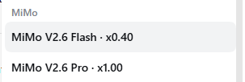
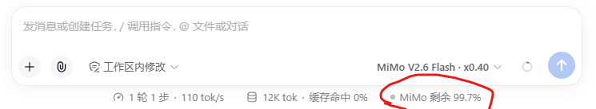
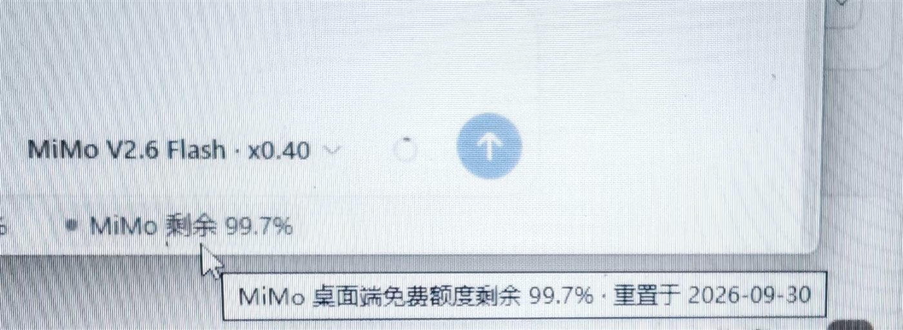

# DSH MiMo Connect

[English](./README.en.md) | 中文

[](./LICENSE)
[](https://www.npmjs.com/package/dsh-mimo-connect)
[](https://nodejs.org)
[](https://github.com/deepseek-ai/deepseek-harness)

将 MiMo 桌面 App 包含的模型自动接入 DeepSeek Harness，在 DSH 对话窗口里零配置使用。

用的是你在 MiMo 客户端里已经登录、已经充值的那份额度——**不需要单独申请 API Key，也不需要额外装常驻程序**。



会话切到 MiMo 时，输入框下方会直接显示剩余额度；用别的模型时它不出现。



悬停可看到重置日。



## 为什么需要它

MiMo 客户端的额度本来只能在客户端里用。想在 DSH 里用上它，通常只有两条路：

| 做法 | 代价 |
|---|---|
| 单独申请平台 API Key | 走的是**平台计费**，与客户端额度是两套账，等于重新花钱 |
| 用第三方反代工具 | 需要**额外装一个常驻程序**，还要配开机自启 |

这个插件是第三条路：**直接复用客户端已经登录的凭证**，把客户端那份额度接进 DSH。不额外申请 Key、不额外装程序、不写开机自启。

## 特性

- **零配置**：客户端已登录，插件装上就能用，不弹任何提示。
- **复用客户端额度**：用的是你在 MiMo 客户端里的那份额度，不是平台计费。
- **无常驻进程**：不启动代理、不注入进程、不写注册表自启项。关掉 DSH 就什么都不剩。
- **剩余额度就地可见**：会话切到 MiMo 时，输入框下方直接显示剩余额度与重置日；用别的模型时它不出现。
- **可脱离客户端使用**：没装客户端也能让插件单独登录一次，之后与客户端无关。
- **跟随账号**：客户端换账号或退出登录，插件自动跟随。
- **支持图片输入**：模型支持时可直接粘贴图片。
- **思考过程可见**：思维链以流式事件呈现。

## 安装

```sh
dsh plugin --profile desktop add dsh-mimo-connect
dsh --profile desktop
```

（把 `desktop` 换成你实际使用的 profile：`web` / `desktop` / `dsh-tui`）

装好后在模型选择器里选择 `MiMo` 分组下的模型即可。

也可以从源码安装：

```sh
dsh plugin --profile desktop add github:anze225-max/dsh-mimo-connect
```

## 凭证来源

插件按下面的顺序解析凭证，**前者存在就不打扰你**：

| 顺序 | 来源 | 说明 |
|---|---|---|
| 1 | `$DSH_HOME/.mimo-connect-auth.json` | 插件自己登录后保存 |
| 2 | MiMo 客户端的 cookie | **只读**复用，不修改客户端任何文件 |
| 3 | 都没有 | 提示运行 `login` 命令 |

客户端的 cookie 读取位置：

```text
%APPDATA%\Xiaomi MiMo\Partitions\xiaomi-account\Network\Cookies
```

该文件是 Chromium 的标准 SQLite cookie 库，插件**复制到临时文件后只读查询**，避免与运行中的客户端争锁。MiMo 的 cookie 值是**明文存储**的（`value` 有值、`encrypted_value` 为空），因此不需要 DPAPI 解密。

## 命令行

```sh
dsh plugin --profile desktop exec dsh-mimo-connect status    # 查看登录状态
dsh plugin --profile desktop exec dsh-mimo-connect verify     # 真实调用一次模型
dsh plugin --profile desktop exec dsh-mimo-connect doctor     # 本地诊断
dsh plugin --profile desktop exec dsh-mimo-connect login      # 单独登录（不用客户端）
dsh plugin --profile desktop exec dsh-mimo-connect logout     # 删除插件自己的凭证
```

### 关于 `login`

小米 passport **不接受第三方回调地址**（返回「Callback连接不合法」），且 `passToken` 是 `HttpOnly`，浏览器 JS 读不到。因此无法做成「点一下自动登录」。

`login` 会给出逐步指引：打开登录页 → 从开发者工具的 Application → Cookies 里复制三个值粘贴回来。插件会立即验证凭证可用后才保存。

**如果你已经装了 MiMo 客户端，就不需要 `login`** —— 直接复用即可。

## 工作原理

```text
客户端凭证（passToken / cUserId / userId）
   ↓  STS 换取（3 步重定向）
serviceToken
   ↓  作为 Cookie 请求头
mimo-server-cn.xiaomimimo.com/api/route/chat/completions
   ↓  标准 OpenAI 协议
DSH 的 LLM seam
```

真实端点是 OpenAI 兼容协议，**没有协议翻译层**。`model.headers` 把 cookie 直接注入 pi-ai 构造的请求，因此也不需要本地 shim。

### 附件服务

插件把宿主的 `attachments` 服务接入适配器。这不是可选项：dsh-llm-pi-ai 只要发现消息里含图片块而拿不到附件服务，就会抛 `UNSUPPORTED_CONTENT`——**连纯文本轮次也会失败**，只要该会话更早的工具结果里出现过图片。

从其他模型切换到 MiMo 时最容易触发，因为历史上下文会被带过来。相关回归测试见 `tests/image-guard.mjs`。

### 一个关键实现细节

网关按域校验身份：把 `.xiaomi.com` 与 `.account.xiaomi.com` 的 cookie **混在一个请求头里发送**会导致会话被判失效，返回 `EXPIRED` 并踢回登录页。插件为此实现了按域隔离的 cookie jar，并且同名 cookie 只发送一次（取最具体域的值）。这条规则由 `tests/cookie-jar.mjs` 与 `tests/session.mjs` 中专门的回归测试守护。

## 剩余额度显示

会话当前用的是 MiMo 时，输入框下方的统计行右侧会出现一枚额度指示：

```text
● MiMo 剩余 99.8%
```

悬停可看到重置日（例如 `重置于 2026-09-30`）。额度低于 20% 时指示点转为提醒色，低于 5% 转为告警色。

**只有会话路由到 MiMo 时才显示。** 用 DeepSeek 或别的模型时，这一行完全不出现，也不会发出任何额度请求——额度显示属于正在花这份额度的会话，不该出现在无关对话里。

数据来自客户端自己的用量接口：

```text
GET mimo-server-cn.xiaomimimo.com/api/user/usage
→ {"code":0,"data":{"percent":99.8,"resetDate":"2026-09-30","resetAt":1790782334}}
```

`percent` 是**剩余**百分比。读取是只读的，不消耗任何额度；结果缓存 60 秒，读失败退避 15 秒，任何失败路径都只是「不显示」，不会影响推理。

实现上，node 半侧注册一条 `/api/mimo.quota` 路由（与其它 `/api` 路由共用同一道浏览器会话校验），浏览器半侧通过 `conversation.composer.dock` 插槽挂载一个组件读取它。宿主没有浏览器连接时（例如 CLI）该路由不注册，provider 照常工作。

## 配置

| 配置项 | 默认值 | 说明 |
|---|---|---|
| `cookieDb` | 空 | 显式指定客户端 cookie 库路径 |
| `pollSeconds` | `30` | 重新检查凭证的间隔（秒）；`0` 关闭轮询 |

环境变量 `MIMO_COOKIE_DB` 可覆盖 cookie 库位置。

## 模型

| ID | 显示名 | 倍率 |
|---|---|---|
| `mimo-v2.6-flash` | MiMo V2.6 Flash | x0.40 |
| `mimo-v2.6-pro` | MiMo V2.6 Pro | x1.00 |

倍率是客户端显示的点数消耗系数，仅作展示，不影响请求。

网关**没有模型列表接口**（`/api/route/models` 等均返回 404），所以这份清单是内置快照，取自客户端 `model-catalog.json` 的 TEXT 条目。

### 没有推理档位选择器

模型选择器里**不会**出现 Off / Minimal / Low / Medium / High 档位。这是有意为之。

这些模型确实会产出思维链（以 `reasoning_content` 返回，在 DSH 中表现为流式的思考过程），但网关**忽略所有实测过的控制参数**：

| 参数 | 推理 token 数 |
|---|---|
| 默认 | 176 / 211 |
| `thinking: { type: 'disabled' }` | 179 |
| `thinking: { enabled: false }` | 237 |
| `reasoning_effort: 'none'` | 181 |
| `reasoning_effort: 'low'` | 205 |
| `enable_thinking: false` | 210 |

全部无效。与其显示一个「调了没反应」的选择器，不如不显示。

## 关于响应速度

实测数据表明**延迟来自上游网关，不是插件**：

| 环节 | 耗时 |
|---|---|
| 会话缓存命中 | 0 ms |
| cookie 头构造 | < 0.01 ms |
| DNS 解析 | 9–28 ms |
| 网络往返（不含推理） | 37–169 ms |
| **一次完整对话** | **1–19 秒（波动极大）** |

同一句「你好」，实测耗时从 1 秒到 19 秒都在出现。绕过插件的裸 `fetch` 请求分布与经插件的请求完全重合，说明插件没有引入可测量的开销。

由于网关忽略推理档位参数，目前**没有插件层面的提速手段**。

## 已知限制

- **依赖非公开接口**。插件使用客户端自身的端点与凭证，非小米官方开放 API；上游变更后可能需要跟随调整。
- **响应速度受上游影响**。延迟波动较大，插件无法控制。
- **额度显示依赖同一套非公开接口**。`/api/user/usage` 变更或下线时，额度指示会静默消失，不影响模型调用。
- **凭证有效期**。`passToken` 实测有效期 30 天；过期后需重新登录（客户端或 `login`）。
- **`serviceToken` 需要短期续期**。插件在会话内自动重换，遇到 401 会重试一次。
- **配额由小米控制**。插件只转发请求，不改变额度、限流或账号权限。

## 开发

```sh
npm run build                 # 生成浏览器半侧 lib/client.js
node tests/run.mjs            # 全部套件
node tests/run.mjs client     # 仅客户端半侧
node tests/run.mjs layout     # 仅排版对照
node tests/run.mjs cookie     # 名称含 cookie 的套件
```

部分套件在检测到可用凭证时会执行真实网络调用，否则自动跳过。

渲染与排版测试需要几个只服务测试的依赖：

```sh
npm i --no-save js-yaml@^4 react@18.3.1 react-dom@18.3.1 jsdom
```

它们不进发布产物——浏览器半侧在 DSH 页面里只从平台基座取 React。

`tools/` 存放本机部署辅助脚本（引用机器相关的 DSH profile 路径），不属于发布测试的一部分。`npm run sync` 会先构建再把插件同步到 desktop profile。

### 浏览器半侧

客户端 bundle 是手写的 `__ModuleLoader__.load(...)` 形式，没有打包器参与：`src/client.js` 就是产物形状，`tools/build-client.mjs` 补一份 source map 后写到 `lib/client.js`。宿主从 `package.json` 的 `dsh.client` 声明发现它，并把 `exports["./client"]` 指向的文件原样提供在 `/plugins` 下。

改完客户端代码必须重启 DSH：bundle 在进程启动时被快照，`patchReload` 不会重新读取它。

### 额度指示为什么能跟上宿主的排版

统计行的两个原生 pill 是同一个 flex 容器 `[data-composer-stats]` 的子项，靠容器自己的 `display:flex; gap:12px` 排列——没有绝对定位，也没有手算偏移。

本插件不能成为那个容器的子项：注册 `conversation.composer.dock` 时宿主没有声明 `children`，slot 注册表里没有子插槽可用。所以组件用 `createPortal` 把 pill **送进** `[data-composer-stats]`，让它成为同一容器的真正子项，排版权完全交给宿主自己的规则。插件只声明 pill 自身的几何。

`tests/layout-parity.mjs` 从 `dsh-client-ui-chat` 的产物里逐字提取宿主 CSS，把两边的 pill 放进同一容器比对**计算样式**，覆盖字号变化、变量缺失、窄容器与深色主题。找不到 DSH 安装目录时整支跳过（退出码 0）；用 `DSH_APP_ROOT` 可指定位置。

统计行会随会话状态挂载与卸载，宿主也可能整体替换它，所以组件在轮询发现之后改用 `MutationObserver` 盯住替换。

## 免责声明

- 本项目**仅供个人学习和研究使用**，仅驱动使用者自己的 MiMo 账号在本机调用，请勿用于商业用途或超出个人合理使用的场景。
- 使用者需遵守小米的服务条款；因使用本项目产生的任何后果（包括但不限于账号被限制、额度被清空、服务中断），由使用者自行承担。
- 本项目与小米、Xiaomi MiMo、DeepSeek 均无关联，未获其授权或认可；文中出现的名称仅用于描述兼容关系，其商标权利归各自所有。

## 致谢

- [dsh-workbuddy-connect](https://github.com/corrinehu/dsh-workbuddy-connect)（MIT）—— 插件组织方式、provider 注册与 `PiAiAdapter` 组装的参照。

## 许可证

[MIT](./LICENSE)
